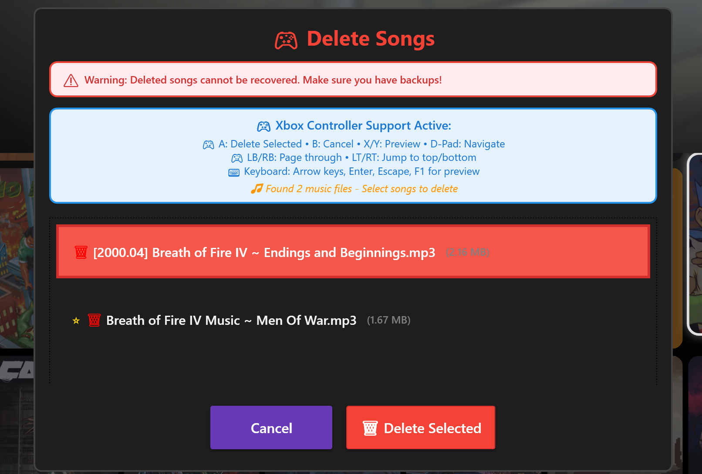

# UniPlaySong Playnite Extension

 

<p align="center">
  
</p>

<p align="center">
  <a href="https://ko-fi.com/Z8Z11SG2IK">
    
  </a>
</p>

A Playnite extension that provides a console-like game music preview experience with controller-friendly song management. Music plays when browsing your game library, creating an immersive experience similar to PlayStation and Xbox game selection screens.

Designed for both Desktop and Fullscreen mode, with compatibility to modern themes (like ANIKI REMAKE).

Built with the help of Claude Code and Cursor IDE

---

## What's New - v1.2.4

### New Features
- **Auto-Delete Music on Game Removal** - Music files are now automatically cleaned up when games are removed from Playnite ([#59](https://github.com/aHuddini/UniPlaySong/issues/59))
- **Clean Up Orphaned Music** - New cleanup tool: Manually remove music folders for games no longer in your library

### Improvements
- **Playnite SDK** updated to version 6.15.0

### Bug Fixes
- **Fullscreen Background Music Volume** - Playnite's fullscreen volume slider now controls UniPlaySong's playback volume in real-time ([#62](https://github.com/aHuddini/UniPlaySong/issues/62))
- **Now Playing GPU Usage** - Fixed top panel animation causing permanent GPU usage; suspends when app is unfocused ([#55](https://github.com/aHuddini/UniPlaySong/issues/55))
- **Audio Stuttering During Video Playback** - Fixed music repeatedly pausing/resuming during trailer/ScreenshotVisualizer playback ([#58](https://github.com/aHuddini/UniPlaySong/issues/58), [#60](https://github.com/aHuddini/UniPlaySong/pull/60)) - Credit: @rovri
- **Media Controls After Live Effects Toggle** - Fixed media control buttons and music becoming unresponsive after toggling live effects ([#56](https://github.com/aHuddini/UniPlaySong/issues/56))

### Previous Versions
- **v1.2.3**: Bulk delete music, safer restart handling, window state pause fixes
- **v1.2.2**: Download Manager with Review Mode, Auto-Add Songs, SoundCloud support
---

## 🎬 Demo
https://github.com/user-attachments/assets/d7a9964e-fa2e-4d66-8de7-9ff16b1010de

---

## 🎵 Features

- **Auto-Download** - Automatic music search and downloads for existing libraries and new games from YouTube, KHInsider, and Zophar's Domain
- **Playback Customization** - Fade effects, preview duration (15s-1min), random song selection
- **Live Reverb Effects** - Real-time reverb effects with 18 Audacity-derived presets and custom controls to enhance preview audio (pairs well with Fullscreen theme aesthetics)
- **Controller Support** - Full Xbox controller navigation for music management in fullscreen mode
- **Audio Editing** - Amplify/Trim tools, audio normalization, and batch operations
- **Theme Integration** - UPS_MusicControl for theme developers and compatibility with modern themes
- **Migration Support** - Seamless import/export from PlayniteSound with cleanup options
- **Desktop Controls** - Optional top panel media controls and Now Playing information
- **Tagging & Filters** - Tag games with music/no music for better music management



---

## 📋 Requirements

| Tool | Purpose | Download |
|------|---------|----------|
| **[yt-dlp](https://github.com/yt-dlp/yt-dlp)** | Downloading music | [GitHub Releases](https://github.com/yt-dlp/yt-dlp/releases) |
| **[Deno](https://deno.com/)** | Required JS runtime for yt-dlp | [Deno.com](https://deno.com/) |
| **[FFmpeg](https://ffmpeg.org/download.html)** | Audio processing | [Official Website](https://ffmpeg.org/download.html) |

> **Note**: Place `deno.exe` in the same folder as `yt-dlp.exe` for automatic detection.

---

## 📦 Installation

### Option 1: Direct Download
1. Download the latest `.pext` file from [Releases](https://github.com/aHuddini/UniPlaySong/releases)
2. Double-click the downloaded file to install

### Option 2: Playnite Add-on Database
Download or update directly from the Playnite add-on database, or browse Generic plugins in Playnite's Add-ons menu

### Setup

1. Download yt-dlp, Deno, and FFmpeg
2. Place `deno.exe` in the same folder as `yt-dlp.exe`
3. In Playnite: **Settings → Add-ons → Extension Settings → UniPlaySong → Downloads Tab**
4. Set paths to `yt-dlp.exe` and `ffmpeg.exe`

---

## 🎮 Usage & Settings

### Quick Start
1. Install yt-dlp, Deno, and FFmpeg (see Requirements above)
2. Right-click games (single or multiple) for music download and management options. Use "bulk download" in add-on settings for alternative bulk downloads
3. Use controller in fullscreen mode: **Menu → Extensions → UniPlaySong**

### Settings Tabs
- **General**: Music playback, volume, fade effects, preview duration, desktop controls
- **Live Effects**: Real-time reverb presets and custom controls
- **Default Music**: Fallback music settings, native Playnite music integration
- **Audio Normalization**: EBU R128 volume leveling and silence trimming
- **Search Cache**: Cache management and auto-update hints database
- **Downloads**: Tool paths, auto-download options, search sources
- **Migration**: Import/export from PlayniteSound
- **Cleanup**: Storage management, reset options, factory reset

**Music Location**: `%APPDATA%\Playnite\ExtraMetadata\UniPlaySong\Games\{GameId}\`  
**Supported Formats**: MP3, WAV, OGG, FLAC, M4A, WMA

---

## 🛠️ Building from Source

```powershell
dotnet clean -c Release && dotnet restore && dotnet build -c Release
powershell -ExecutionPolicy Bypass -File .\package_extension.ps1 -Configuration Release
```

See `docs/dev_docs/` for detailed build instructions.

---

## 🙏 Credits

**Inspired by [PlayniteSound](https://github.com/joyrider3774/PlayniteSound)** - Special thanks to the original developer for the foundation that made this project possible.

### Libraries & Dependencies
- **Playnite SDK** - Extension framework
- **SDL2 & SDL2_mixer** - Audio playback (zlib license)
- **MaterialDesignThemes** - WPF UI components (MIT)
- **HtmlAgilityPack, Newtonsoft.Json, NAudio, FuzzySharp** - Core functionality (MIT)
- **TagLibSharp** - Audio metadata (LGPL)
- **yt-dlp** - Media downloading (Unlicense)
- **FFmpeg** - Audio processing (LGPL/GPL)

### Third-Party Acknowledgments
See [LICENSE](LICENSE) file for component licenses and acknowledgments.

---

## 📄 License

MIT License - See [LICENSE](LICENSE) file

## 🔗 Links

- [GitHub Repository](https://github.com/aHuddini/UniPlaySong)
- [PlayniteSound](https://github.com/joyrider3774/PlayniteSound)
- [Playnite](https://playnite.link/)
