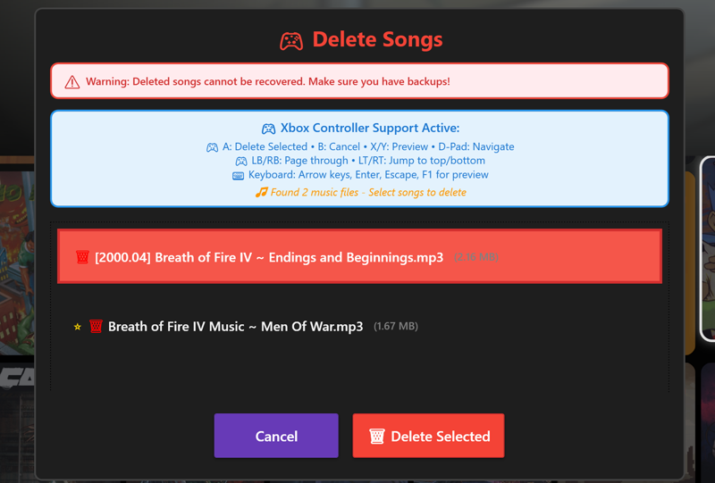

# UniPlaySong Playnite Extension

    

<p align="center">
  
</p>

<p align="center">
  <a href="https://ko-fi.com/Z8Z11SG2IK">
    
  </a>
</p>

A Playnite extension that provides a console-like game music preview experience with controller-friendly song management. Music plays when browsing your game library, creating an immersive experience similar to PlayStation and Xbox game selection screens.

Designed for both Desktop and Fullscreen mode, with compatibility to modern themes (like ANIKI REMAKE).

Built with the help of Claude Code and Cursor IDE

---

## What's New - v1.4.2

- **Fullscreen Volume Boost** — New opt-in slider in Playback settings (0–20%, default 0%) that slightly nudges music volume up in Fullscreen mode to compensate for how Playnite's own Background Volume slider stacks on top of UPS's Music Volume. Only active in Fullscreen; Desktop is unaffected.
- **Fullscreen Quick Settings Menu** — Menu → Extensions → UniPlaySong in Fullscreen now exposes the most-commonly-tweaked settings as controller-navigable items: Live Effects, Radio Mode, Preview Mode, Play Only on Game Select, Music Only for Installed Games, plus sub-menus for Reverb Preset (32 options) and Default Music Source (8 options). Current value is marked with ●. No more dropping to Desktop to flip a switch.
- **Fullscreen Exit: No More Stray Music** — When exiting Fullscreen (Switch to Desktop), you'd sometimes briefly hear ~1 second of the currently-selected game's music start up during the transition, then cut off. Fixed — the late-fired theme overlay events that were triggering the unwanted playback are now ignored during shutdown.
- **Persistent Default Music Backdrop** — When using pool-based default music sources (Random Game, Custom Folder, Custom Rotation, Completion Status Pool), the same track now keeps playing by default as you browse games, instead of re-rolling to a different song on every hover. Combined with a new "Auto-advance Default Music on song end" toggle (disable it for the current song to loop rather than pick a new one), you can now have a truly persistent single-track backdrop while browsing.
- **Stay Paused After External Audio (Desktop)** — New option in the Pauses tab: when UPS is paused because another app started playing audio (YouTube, Discord, etc.), you can now have UPS stay paused until you manually resume via the top panel play/pause button or your media keys — instead of the music auto-resuming the moment the external audio stops. Desktop mode only.

### Previous Version
- **v1.4.1**: Retro chiptune pause/resume fixes (UI freezes, silent jingle returns), song-end fade geometry, Fanfare on "Beaten" status, Abandoned status jingle + toast with 10 bundled failure-themed jingles, Play Only on Game Select randomization fixes, internal jingle playback refactor

> **Release Availability Notice:** Due to a sudden GitHub account suspension in February 2026, releases prior to v1.3.3 are no longer available for download. Changelog history for all versions is preserved for historical reference.

---

## 🎬 Demo
https://github.com/user-attachments/assets/d7a9964e-fa2e-4d66-8de7-9ff16b1010de

---

## 🎵 Features

- **Playback Customization** - Fade effects, preview duration (15s-1min), random song selection
- **Live Reverb Effects** - Real-time reverb effects with 18 Audacity-derived presets and custom controls to enhance preview audio (pairs well with Fullscreen theme aesthetics)
- **Audio-Reactive Visualizer** - Real-time spectrum visualizer with 22 color themes including Dynamic game-art colors, tuning presets, and per-bar gradient rendering (Desktop mode)
- **Controller Support** - Full Xbox controller navigation for music management in fullscreen mode
- **Audio Editing** - Amplify/Trim tools, audio normalization, and batch operations
- **Theme Integration** - UPS_MusicControl for theme developers and compatibility with modern themes
- **Migration Support** - Seamless import/export from PlayniteSound with cleanup options
- **Desktop Controls** - Optional top panel media controls and Now Playing information
- **Tagging & Filters** - Tag games with music/no music for better music management



---

## 📋 Requirements

| Tool | Purpose | Download |
|------|---------|----------|
| **[yt-dlp](https://github.com/yt-dlp/yt-dlp)** | Music searching and downloading | [GitHub Releases](https://github.com/yt-dlp/yt-dlp/releases) |
| **[Deno](https://deno.com/)** | Required JS runtime for yt-dlp | [Deno.com](https://deno.com/) |
| **[FFmpeg](https://ffmpeg.org/download.html)** | Audio processing | [Official Website](https://ffmpeg.org/download.html) |

> **Note**: Place `deno.exe` in the same folder as `yt-dlp.exe` for automatic detection.

---

## 📦 Installation

### Option 1: Direct Download
1. Download the latest `.pext` file from [Releases](https://gitea.com/aHuddini/UniPlaySong/releases)
2. Double-click the downloaded file to install

### Option 2: Playnite Add-on Database
Download or update directly from the Playnite add-on database, or browse Generic plugins in Playnite's Add-ons menu

### Setup

1. Download yt-dlp, Deno, and FFmpeg
2. Place `deno.exe` in the same folder as `yt-dlp.exe`
3. In Playnite: **Settings → Add-ons → Extension Settings → UniPlaySong → Downloads Tab**
4. Set paths to `yt-dlp.exe` and `ffmpeg.exe`

---

## 🎮 Usage & Settings

### Quick Start
1. Install yt-dlp, Deno, and FFmpeg (see Requirements above)
2. Right-click games for music search and download options via YouTube
3. Use controller in fullscreen mode: **Menu → Extensions → UniPlaySong**

### Settings Tabs
- **General**: Music behavior, top panel media controls, taskbar thumbnail controls, now playing display, tags, troubleshooting
- **Playback**: Volume, fade effects, preview mode, song randomization, default music (6 sources including custom folder/random game/rotation pool), completion fanfare, random game picker music, game property filter, filter mode, radio mode
- **Pauses**: Pause on play, system lock, focus loss, minimize, system tray, external audio, idle/AFK
- **Live Effects**: Real-time audio effects, reverb presets, spectrum visualizer
- **Audio Editing**: EBU R128 volume normalization and silence trimming
- **Downloads**: Tool paths, cookie source, YouTube search and download
- **Search**: Search result caching and auto-search hints database
- **Migration**: Import/export from PlayniteSound
- **Cleanup**: Storage management, reset options, factory reset
- **Experimental**: Media key control, song progress bar, peak meter, library statistics with audio metrics, icon glow

**Music Location**: `%APPDATA%\Playnite\ExtraMetadata\UniPlaySong\Games\{GameId}\`
**Supported Formats**: MP3, WAV, OGG, FLAC, M4A, WMA — plus VGM (Sega Genesis / Mega Drive chiptune).

---

## 🛠️ Building from Source

```powershell
dotnet clean -c Release && dotnet build -c Release
powershell -ExecutionPolicy Bypass -File .\scripts\package_extension.ps1 -Configuration Release
```

See `docs/dev_docs/` for detailed build instructions.

---

## 🙏 Credits

**Inspired by [PlayniteSound](https://github.com/joyrider3774/PlayniteSound)** - Special thanks to the original developer for the foundation that made this project possible.

### Bundled Libraries
- **Playnite SDK** - Extension framework
- **SDL2 & SDL2_mixer** - Audio playback (zlib license)
- **MaterialDesignThemes** - WPF UI components (MIT)
- **HtmlAgilityPack, Newtonsoft.Json, NAudio, NVorbis, FuzzySharp** - Core functionality (MIT)
- **TagLibSharp** - Audio metadata (LGPL)
- **[Game Music Emu](https://github.com/libgme/game-music-emu)** - Retro chiptune decoder (LGPL v2.1+, dynamic linking)
- **[zlib](https://github.com/madler/zlib)** - Decompression for VGZ files (zlib license)

### External Tools (installed by user)
- **yt-dlp** - Media searching and downloading (Unlicense)
- **FFmpeg** - Audio processing (LGPL/GPL)
- **Deno** - JavaScript runtime required by yt-dlp (MIT)

### Third-Party Acknowledgments
See [LICENSE](LICENSE) file for component licenses and acknowledgments.

---

## 📄 License

MIT License - See [LICENSE](LICENSE) file

## 🔗 Links

- [Gitea Repository](https://gitea.com/aHuddini/UniPlaySong)
- [PlayniteSound](https://github.com/joyrider3774/PlayniteSound)
- [Playnite](https://playnite.link/)
