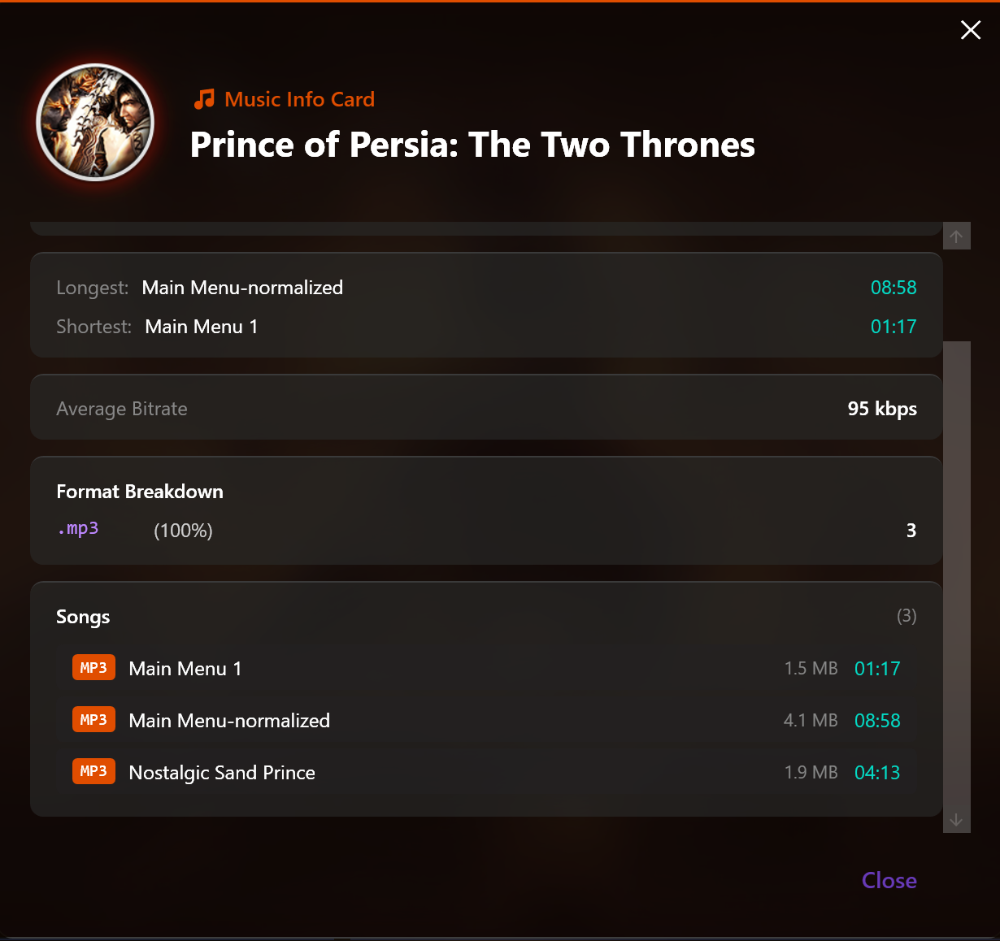

# UniPlaySong Playnite Extension

   

<p align="center">
  
</p>

<p align="center">
  <a href="https://ko-fi.com/Z8Z11SG2IK">
    
  </a>
</p>

A Playnite extension that provides a console-like game music preview experience with controller-friendly song management. Music plays when browsing your game library, creating an immersive experience similar to PlayStation and Xbox game selection screens.

Designed for both Desktop and Fullscreen mode, with compatibility to modern themes (like ANIKI REMAKE).

Built with the help of Claude Code and Cursor IDE

---

## What's New - v1.6.8

### Fixed
- **Music no longer restarts when you come back to Playnite.** With "Pause on focus loss" on, game music now resumes right where it left off instead of starting over — and if it ever gets stuck paused, the play button will always bring it back.
- **Settings crash fixed.** Reopening UniPlaySong's settings after saving could freeze and crash Playnite with no error message. Settings now open instantly, every time.
- **Settings window cleanup.** The settings window no longer leaks resources each time it's opened and closed.

### Fix Attempt
- **Fix attempt (issue #87): failed auto-downloads now tell you which games failed.** The notification after automatic music downloads lists the failed game names (not just a count) so you can retry them manually.

### Docs
- **Theme achievement sounds: name the files with one-word rarities.** If a theme provides per-rarity unlock sounds, the files in `audio/Achievements/` must be named `common`, `uncommon`, `rare`, `ultrarare`, `capstone` — one word, no hyphen or space. `Ultra-Rare.wav` won't be recognized (rename it `ultrarare.wav`); this was why some theme packs only played 4 of the 5 rarities.

### Previous Version
- **v1.6.7**: Prepared UniPlaySong to integrate with the upcoming FullReel plugin — external pause/play now fully controls Spotify as a radio source.

> **Release Availability Notice:** Due to a sudden GitHub account suspension in February 2026, releases prior to v1.3.3 are no longer available for download. Changelog history for all versions is preserved for historical reference.

---

## 🎬 Demo
https://github.com/user-attachments/assets/d7a9964e-fa2e-4d66-8de7-9ff16b1010de

---

## 🎵 Features

- **Playback Customization** - Fade effects, preview duration (15s-1min), random song selection
- **Live Reverb Effects** - Real-time reverb effects with 18 Audacity-derived presets and custom controls to enhance preview audio (pairs well with Fullscreen theme aesthetics)
- **Audio-Reactive Visualizer** - Real-time spectrum visualizer with 22 color themes including Dynamic game-art colors, tuning presets, and per-bar gradient rendering (Desktop mode)
- **Controller Support** - Full Xbox controller navigation for music management in fullscreen mode
- **Audio Editing** - Amplify/Trim tools, audio normalization, and batch operations
- **Theme Integration** - UPS_MusicControl for theme developers and compatibility with modern themes
- **Migration Support** - Seamless import/export from PlayniteSound with cleanup options
- **Desktop Controls** - Optional top panel media controls and Now Playing information
- **Tagging & Filters** - Tag games with music/no music for better music management


### Music Info Card (v1.5.0+)

Right-click any game → **Music Info Card** for a stylized per-game music dashboard. Each card picks up the game's art and accent colors so it feels native to that title.



---

## 🎵 Supported Audio Formats

| Category | Format | Notes |
|----------|--------|-------|
| **Standard** | `.mp3` | The default UPS uses for downloads and conversions |
| **Standard** | `.ogg` | Ogg Vorbis |
| **Standard** | `.flac` | Lossless |
| **Standard** | `.wav` | Uncompressed |
| **Chiptune** | `.vgm` / `.vgz` | Sega Genesis / Mega Drive / Sega CD (and other VGM-supported systems). `.vgz` is gzip-compressed VGM. |
| **Chiptune** | `.nsf` | NES / Famicom. Right-click → Chiptunes → **Manage NSF Tracks** for per-track curation + loop overrides. |
| **Chiptune** | `.spc` | SNES / Super Famicom |
| **Chiptune** | `.hes` | NEC TurboGrafx-16 / PC Engine. Requires a sibling `.m3u` for multi-track playback. Right-click → Chiptunes → **Split HES Tracks** to break a multi-track HES into individual songs for skip/shuffle. |

> Chiptune playback is powered by [Game Music Emu](https://github.com/libgme/game-music-emu) (LGPL v2.1+, dynamically linked). See `NOTICES.txt` and `docs/dev_docs/GME_BUILD.md` for license + build details.

---

## 📋 Requirements

| Tool | Purpose | Download |
|------|---------|----------|
| **[yt-dlp](https://github.com/yt-dlp/yt-dlp)** | Music searching and downloading — **required** for downloads | [GitHub Releases](https://github.com/yt-dlp/yt-dlp/releases) |
| **[Deno](https://deno.com/)** | Required JS runtime for yt-dlp | [Deno.com](https://deno.com/) |
| **[FFmpeg](https://ffmpeg.org/download.html)** | **Required** for downloads (audio extraction/conversion); also powers editing features (normalize, trim, convert) | [Official Website](https://ffmpeg.org/download.html) |

> **Note**: Place `deno.exe` in the same folder as `yt-dlp.exe` for automatic detection. Downloads need **both** yt-dlp and FFmpeg configured.

---

## 📦 Installation

### Option 1: Direct Download
1. Download the latest `.pext` file from [Releases](https://gitea.com/aHuddini/UniPlaySong/releases)
2. Double-click the downloaded file to install

### Option 2: Playnite Add-on Database
Download or update directly from the Playnite add-on database, or browse Generic plugins in Playnite's Add-ons menu

### Setup

1. Download yt-dlp, Deno, and FFmpeg (all three are required for download functionality)
2. Place `deno.exe` in the same folder as `yt-dlp.exe`
3. In Playnite: **Settings → Add-ons → Extension Settings → UniPlaySong**
4. **Downloads tab** → set the path to `yt-dlp.exe`
5. **Editing tab** → set the path to `ffmpeg.exe`

---

## 🎮 Usage & Settings

### Quick Start
1. Install yt-dlp, Deno, and FFmpeg (see Requirements above)
2. Right-click games for music search and download options via YouTube
3. Use controller in fullscreen mode: **Menu → Extensions → UniPlaySong**

### Settings Tabs
- **General**: Music behavior, top panel media controls, taskbar thumbnail controls, now playing display, tags, troubleshooting
- **Playback**: Volume, fade effects, preview mode, song randomization, default music (6 sources including custom folder/random game/rotation pool), random game picker music, game property filter, filter mode, radio mode
- **Gamification**: Completion celebration (fanfare + toast), achievement unlock sounds, abandoned-status sound + toast
- **Pauses**: Pause on play, system lock, focus loss, minimize, system tray, external audio, idle/AFK
- **Live Effects**: Real-time audio effects, reverb presets, spectrum visualizer
- **Audio Editing**: EBU R128 volume normalization and silence trimming
- **Theme Support**: Compatibility options for theme developers (overlay/video pause opt-outs, PS5-Experience mode)
- **Downloads**: Tool paths, cookie source, YouTube search and download, search caching and hints database
- **Migration**: Import/export from PlayniteSound
- **Cleanup**: Storage management, reset options, factory reset
- **Experimental**: Media key control, song progress bar, peak meter, library statistics with audio metrics, icon glow

**Music Location**: `%APPDATA%\Playnite\ExtraMetadata\UniPlaySong\Games\{GameId}\`
**Supported Formats**: MP3, WAV, OGG, FLAC, M4A, WMA — plus chiptune: VGM/VGZ (Sega Genesis / Mega Drive), NSF (NES / Famicom), SPC (SNES / Super Famicom), HES (NEC TurboGrafx-16 / PC Engine — requires sibling `.m3u` for multi-track playback or splitting).

---

## 🛠️ Building from Source

```powershell
dotnet clean -c Release && dotnet build -c Release
powershell -ExecutionPolicy Bypass -File .\scripts\package_extension.ps1 -Configuration Release
```

See `docs/dev_docs/` for detailed build instructions.

---

## 🙏 Credits

**Inspired by [PlayniteSound](https://github.com/joyrider3774/PlayniteSound)** - Special thanks to the original developer for the foundation that made this project possible.

### Collaborations & Contributors
- **[Playnite Achievements](https://github.com/justin-delano/PlayniteAchievements) by Justin Delano** — collaboration on the achievement unlock sound feature. His plugin tells UniPlaySong when an achievement is earned so UPS can play the sound, and his rarity badge artwork (MIT) is used in the achievement settings. Thanks to Justin for the cross-plugin integration.
- **[Mike Aniki](https://github.com/Mike-Aniki/Aniki-ReMake)** — author of the Aniki ReMake theme. His theme's notification sounds are bundled (with permission) as UniPlaySong's default achievement-sound presets, and he requested/tested several theme-integration features.

### Bundled Libraries
- **Playnite SDK** - Extension framework
- **SDL2 & SDL2_mixer** - Audio playback (zlib license)
- **MaterialDesignThemes** - WPF UI components (MIT)
- **HtmlAgilityPack, Newtonsoft.Json, NAudio, NVorbis, FuzzySharp** - Core functionality (MIT)
- **[Dubya.WindowsMediaController](https://github.com/DubyaDude/WindowsMediaController)** by DubyaDude - Windows SMTC media-session control, powers the Spotify integration (MIT)
- **TagLibSharp** - Audio metadata (LGPL)
- **[Game Music Emu](https://github.com/libgme/game-music-emu)** - Retro chiptune decoder (LGPL v2.1+, dynamic linking — see [`docs/dev_docs/GME_BUILD.md`](docs/dev_docs/GME_BUILD.md) for the source pin and reproducible build)
- **[zlib](https://github.com/madler/zlib)** - Decompression for VGZ files (zlib license)

### External Tools (installed by user)
- **yt-dlp** - Media searching and downloading (Unlicense)
- **FFmpeg** - Audio processing (LGPL/GPL)
- **Deno** - JavaScript runtime required by yt-dlp (MIT)

### Third-Party Acknowledgments
Full per-component notices, upstream URLs, license text, and LGPL §6 source-availability pointers live in [`NOTICES.txt`](NOTICES.txt) (also bundled in the `.pext`).

---

## 📄 License

UniPlaySong is **MIT** — see [`LICENSE`](LICENSE).
Bundled third-party components ship under their own licenses — see [`NOTICES.txt`](NOTICES.txt).

## 🔗 Links

- [Gitea Repository](https://gitea.com/aHuddini/UniPlaySong)
- [PlayniteSound](https://github.com/joyrider3774/PlayniteSound)
- [Playnite Achievements](https://github.com/justin-delano/PlayniteAchievements) by Justin Delano
- [Aniki ReMake theme](https://github.com/Mike-Aniki/Aniki-ReMake) by Mike Aniki
- [Playnite](https://playnite.link/)
