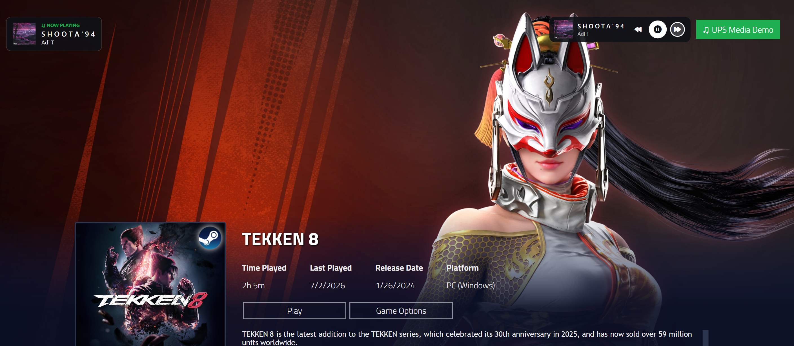

# UniPlaySong Theme Integration Guide

How to wire your Playnite Fullscreen theme into UniPlaySong's music playback.

**Special thanks to Mike Aniki** for guidance and testing on this.

---

## What you can do with UPS

| Goal | Tool |
|---|---|
| Pause UPS music while an overlay / video / login screen is up | `UPS_MusicControl` element |
| Keep UPS music playing during a **decorative/silent** theme video (don't let it pause the music) | Set the video's `IsMuted="True"` (or `Volume="0"`) — UPS ignores muted video automatically |
| Swap game music for the user's default music while a custom panel is open (tag editor, sidebar, etc.) — restore game music on close | `UPS_MusicControl_PauseGamePlayDefault` element (v1.5.3+) |
| Bind UPS settings (Enable Music, Radio Mode, Calm Down, etc.) to checkboxes in your theme | `{PluginSettings}` markup (v1.4.6+) |
| Ship a dedicated audio track that UPS plays as default music | `UPS_BackgroundAudio.mp3` in your theme's `audio/` folder (v1.5.2+) |
| Custom media-control buttons (play, pause, skip, volume) | `playnite://uniplaysong/...` URIs (v1.3.10+) |
| Drop in a ready-made Now-Playing overlay, transport bar, or minimal play/skip control | `UPS_MediaControllerOverlay` / `UPS_MediaControllerBar` / `UPS_MediaControllerCompact` elements (v1.5.8+) |

---

## 1. Pause music with `UPS_MusicControl`

The most common use — pause UPS music while a theme overlay is visible.

### Quick start

```xml
<ContentControl x:Name="UPS_MusicControl"
    Tag="{Binding ElementName=MyOverlay, Path=IsVisible}" />
```

- `Tag="True"` → music fades out
- `Tag="False"` → music fades back in

### DataTrigger style (more flexible)

```xml
<ContentControl x:Name="UPS_MusicControl">
    <ContentControl.Style>
        <Style TargetType="ContentControl">
            <Setter Property="Tag" Value="False"/>
            <Setter Property="Focusable" Value="False"/>
            <Style.Triggers>
                <!-- Pause during intro video -->
                <DataTrigger Binding="{Binding ElementName=IntroHost, Path=Tag}" Value="Playing">
                    <Setter Property="Tag" Value="True"/>
                </DataTrigger>

                <!-- Pause when settings menu is visible -->
                <DataTrigger Binding="{Binding ElementName=SettingsPanel, Path=Visibility}" Value="Visible">
                    <Setter Property="Tag" Value="True"/>
                </DataTrigger>

                <!-- Resume when overlay ends -->
                <DataTrigger Binding="{Binding ElementName=IntroHost, Path=Tag}" Value="Ended">
                    <Setter Property="Tag" Value="False"/>
                </DataTrigger>
            </Style.Triggers>
        </Style>
    </ContentControl.Style>
</ContentControl>
```

### MultiDataTrigger (pause only when ALL conditions match)

```xml
<MultiDataTrigger>
    <MultiDataTrigger.Conditions>
        <Condition Binding="{Binding ElementName=TrailerContainer, Path=Opacity}" Value="1"/>
        <Condition Binding="{Binding ElementName=VideoPlayer, Path=Content.IsPlayerMuted}" Value="False"/>
    </MultiDataTrigger.Conditions>
    <Setter Property="Tag" Value="True"/>
</MultiDataTrigger>
```

### Don't pause Radio Mode music for your overlay — gate the `Tag` on `RadioModeEnabled`

A `Tag="True"` on `UPS_MusicControl` pauses **whatever** is currently playing, including Radio Mode (a pool, or Spotify). If your overlay (welcome hub, sidebar, menu) should pause per-game music but let *Radio Mode* keep playing, add `RadioModeEnabled` as a condition so the pause only fires when Radio Mode is **off**:

```xml
<MultiDataTrigger>
    <MultiDataTrigger.Conditions>
        <Condition Binding="{PluginSettings Plugin=AnikiHelper, Path=IsWelcomeHubOpen}" Value="True"/>
        <!-- only pause when Radio Mode is OFF; Radio Mode music plays through the hub -->
        <Condition Binding="{PluginSettings Plugin=UniPlaySong, Path=RadioModeEnabled}" Value="False"/>
    </MultiDataTrigger.Conditions>
    <Setter Property="Tag" Value="True"/>
</MultiDataTrigger>
```

`RadioModeEnabled` covers **all** Radio Mode sources (a UPS pool *or* Spotify) — that's usually what you want, and it's the simplest gate. There is no separate "Spotify radio" mode: Spotify is just one of the sources Radio Mode can play, chosen by the user in UniPlaySong's settings.

If you specifically need to distinguish **Spotify-as-radio** from a UPS-pool radio (e.g. pause pool-radio but never Spotify), bind the derived read-only `SpotifyRadioMode` instead — it's `true` only when Radio Mode is on **and** the source is Spotify:

```xml
<Condition Binding="{PluginSettings Plugin=UniPlaySong, Path=SpotifyRadioMode}" Value="False"/>
```

Both properties update live as the user toggles Radio Mode or switches the source, so the trigger re-evaluates on the fly. (Prefer `RadioModeEnabled` unless you truly need the Spotify-only distinction.)

### ANIKI REMAKE reference

The full set of triggers Mike Aniki uses for intro videos, trailers, settings, and welcome control:

```xml
<ContentControl x:Name="UPS_MusicControl">
    <ContentControl.Style>
        <Style TargetType="ContentControl">
            <Setter Property="Tag" Value="False"/>
            <Style.Triggers>
                <DataTrigger Binding="{Binding ElementName=IntroHost, Path=Tag}" Value="Idle">
                    <Setter Property="Tag" Value="True"/>
                </DataTrigger>
                <DataTrigger Binding="{Binding ElementName=IntroHost, Path=Tag}" Value="Playing">
                    <Setter Property="Tag" Value="True"/>
                </DataTrigger>
                <DataTrigger Binding="{Binding ElementName=IntroHost, Path=Tag}" Value="Ended">
                    <Setter Property="Tag" Value="False"/>
                </DataTrigger>
                <DataTrigger Binding="{PluginSettings Plugin=ThemeOptions, Path=Options[IntroVideo_None]}" Value="True">
                    <Setter Property="Tag" Value="False"/>
                </DataTrigger>
                <MultiDataTrigger>
                    <MultiDataTrigger.Conditions>
                        <Condition Binding="{Binding ElementName=TrailerContainer, Path=Opacity}" Value="1"/>
                        <Condition Binding="{Binding ElementName=ExtraMetadataLoader_VideoLoaderControl_NoControls_Sound, Path=Content.IsPlayerMuted}" Value="False"/>
                    </MultiDataTrigger.Conditions>
                    <Setter Property="Tag" Value="True"/>
                </MultiDataTrigger>
                <DataTrigger Binding="{Binding ElementName=AcceuilSettings, Path=Visibility}" Value="Visible">
                    <Setter Property="Tag" Value="True"/>
                </DataTrigger>
                <DataTrigger Binding="{Binding ElementName=WelcomeControl, Path=Tag}" Value="False">
                    <Setter Property="Tag" Value="True"/>
                </DataTrigger>
            </Style.Triggers>
        </Style>
    </ContentControl.Style>
</ContentControl>
```

### Keep music playing during decorative videos — mute them with `IsMuted="True"`

UPS automatically pauses your game music when it detects a **theme video that is actually producing sound**. It does *not* pause for silent video. A video counts as "playing" only when **all three** are true:

- the `MediaElement` has an audio track (`HasAudio`),
- it is **not** muted (`IsMuted="False"`), and
- its `Volume` is above `0`.

So if your theme shows a **decorative or background video** that should *not* stop the music — an intro loop, a trophy/menu flourish, an ambient background clip — mark that element muted and UPS will ignore it:

```xml
<MediaElement Source="..."
              IsMuted="True"
              LoadedBehavior="Play" />
```

With `IsMuted="True"` (or `Volume="0"`), UPS never treats the video as audible playback, so your game music keeps playing while it's on screen. No `UPS_MusicControl` wiring needed for this — it's automatic.

**When to use which:**

| You want... | Do this |
|---|---|
| A video's **own audio** to take over (trailer, cutscene) — UPS music pauses | Leave the video **unmuted** (`IsMuted="False"`, `Volume > 0.8`). UPS pauses automatically. |
| A **silent/decorative** video to play *over* the music — music keeps going | Set the video **`IsMuted="True"`** (or `Volume="0"`). UPS ignores it. |
| Pause music for a **non-video overlay** (login panel, sidebar, menu) | Use `UPS_MusicControl` with a `Tag` trigger (above) — muting doesn't apply to non-video elements. |

> Tip: this is the cleanest way to handle background/ambient video. You don't need a `UPS_MusicControl` Tag trigger for muted videos — just mute the element and UPS does the right thing.

---

## 2. Swap game music for default music — `UPS_MusicControl_PauseGamePlayDefault` (v1.5.3+)

Where `UPS_MusicControl` pauses **everything**, this sibling element **swaps** the current game's own music for the user's chosen default music (Bundled Ambient, Random Game, Custom Folder — whatever they configured) while `Tag=True`, and restores game music when `Tag=False`.

Use case: background music keeps playing while the user interacts with a custom panel (tag editor, sidebar) — no silence, no game-track stutter.

```xml
<ContentControl x:Name="UPS_MusicControl_PauseGamePlayDefault">
    <ContentControl.Style>
        <Style TargetType="ContentControl">
            <Setter Property="Tag" Value="False"/>
            <Style.Triggers>
                <DataTrigger Binding="{Binding ElementName=TagEditor, Path=IsOpen}" Value="True">
                    <Setter Property="Tag" Value="True"/>
                </DataTrigger>
            </Style.Triggers>
        </Style>
    </ContentControl.Style>
</ContentControl>
```

- Works alongside `UPS_MusicControl` — they're independent. A pause request from `UPS_MusicControl` still wins over a swap request.
- Multiple instances stack: if ANY active instance has `Tag=True`, the swap is active.

Equivalent without an element in the visual tree:

```xml
<CheckBox IsChecked="{PluginSettings Plugin=UniPlaySong,
                                    Path=ForceDefaultMusicOverride,
                                    Mode=TwoWay}"/>
```

---

## 3. Bind UPS settings to theme checkboxes — `{PluginSettings}` (v1.4.6+)

For an in-theme audio quick-settings menu (Enable Game Music, Radio Mode, Calm Down Mode, etc.), use Playnite's `{PluginSettings}` markup. **No UPS element required in the visual tree** — and the binding silently no-ops if UPS isn't installed (no theme crash).

### The five most-toggled settings

| `Path=` | Type | What it controls |
|---|---|---|
| `EnableMusic` | bool | Game music. Default music keeps playing if `EnableDefaultMusic` is on (toggle both off for full silence) |
| `EnableDefaultMusic` | bool | Default / ambient music |
| `RadioModeEnabled` | bool | Continuous pool-based playback |

> **Radio source is the user's choice.** Binding a toggle to `RadioModeEnabled` turns Radio Mode on/off; the *source* it plays (a UPS pool, or **Spotify**) is chosen by the user in UniPlaySong's settings (Playback → Radio Mode → source). So your existing "Radio Mode" button automatically honors Spotify when the user has picked it — no theme change needed. (Optional: `RadioMusicSource` is also bindable if you want to offer a source picker in your theme.)
>
> **Read-only status (for gating your own triggers):** `RadioModeEnabled` also reads back the current state, and the derived read-only `SpotifyRadioMode` is `true` only when Radio Mode is on *and* the source is Spotify. Both update live — use them to keep an overlay from pausing Radio Mode music (see [Don't pause Radio Mode music for your overlay](#dont-pause-radio-mode-music-for-your-overlay--gate-the-tag-on-radiomodeenabled)).
| `PlayOnlyOnGameSelect` | bool | When false, music plays while browsing too |
| `CalmDownModeEnabled` | bool | v1.5.0+ — gentle muffle + dim over 1.5s (great for late-night browsing toggles) |

Any property on `UniPlaySongSettings` is bindable this way — these five are just the most useful for a quick-options menu.

### Quick-options panel example

```xml
<StackPanel>
    <CheckBox Content="Enable Game Music"
              IsChecked="{PluginSettings Plugin=UniPlaySong,
                                         Path=EnableMusic, Mode=TwoWay}"/>

    <CheckBox Content="Enable Default Music"
              IsChecked="{PluginSettings Plugin=UniPlaySong,
                                         Path=EnableDefaultMusic, Mode=TwoWay}"/>

    <CheckBox Content="Radio Mode"
              IsChecked="{PluginSettings Plugin=UniPlaySong,
                                         Path=RadioModeEnabled, Mode=TwoWay}"/>

    <CheckBox Content="Play Only on Game Select"
              IsChecked="{PluginSettings Plugin=UniPlaySong,
                                         Path=PlayOnlyOnGameSelect, Mode=TwoWay}"/>

    <CheckBox Content="Calm Down Mode"
              IsChecked="{PluginSettings Plugin=UniPlaySong,
                                         Path=CalmDownModeEnabled, Mode=TwoWay}"/>
</StackPanel>
```

Two-way sync is automatic — flipping a checkbox in the theme and flipping the same setting in UPS's own settings dialog stay in sync.

### Aniki ReMake reference (drop-in)

Mike's exact paste-in for Aniki ReMake — `Views/AdditionalViews/QuickOptionsView.xaml`, inside the existing `<Grid x:Name="Volume">`, after the BackgroundVolume slider:

```xml
<CheckBoxEx Margin="0,30,0,0"
            HorizontalAlignment="Stretch"
            VerticalAlignment="Center"
            Style="{DynamicResource SettingsSectionCheckbox}"
            Content="Enable Game Music"
            IsChecked="{PluginSettings Plugin=UniPlaySong, Path=EnableMusic, Mode=TwoWay}" />

<CheckBoxEx Margin="0,10,0,0"
            HorizontalAlignment="Stretch"
            VerticalAlignment="Center"
            Style="{DynamicResource SettingsSectionCheckbox}"
            Content="Enable Default Music"
            IsChecked="{PluginSettings Plugin=UniPlaySong, Path=EnableDefaultMusic, Mode=TwoWay}" />

<CheckBoxEx Margin="0,10,0,0"
            HorizontalAlignment="Stretch"
            VerticalAlignment="Center"
            Style="{DynamicResource SettingsSectionCheckbox}"
            Content="Radio Mode"
            IsChecked="{PluginSettings Plugin=UniPlaySong, Path=RadioModeEnabled, Mode=TwoWay}" />

<CheckBoxEx Margin="0,10,0,0"
            HorizontalAlignment="Stretch"
            VerticalAlignment="Center"
            Style="{DynamicResource SettingsSectionCheckbox}"
            Content="Play Only on Game Select"
            IsChecked="{PluginSettings Plugin=UniPlaySong, Path=PlayOnlyOnGameSelect, Mode=TwoWay}" />

<CheckBoxEx Margin="0,10,0,0"
            HorizontalAlignment="Stretch"
            VerticalAlignment="Center"
            Style="{DynamicResource SettingsSectionCheckbox}"
            Content="Calm Down Mode"
            IsChecked="{PluginSettings Plugin=UniPlaySong, Path=CalmDownModeEnabled, Mode=TwoWay}" />
```

Adapting to other themes:

- **`CheckBoxEx` vs `CheckBox`** — `CheckBoxEx` is Playnite's controller-friendly variant (D-Pad focus traversal). If your theme uses plain `CheckBox`, just swap the element name; the binding is identical.
- **`Style="{DynamicResource ...}"`** — substitute whatever checkbox style your theme exposes. `{PluginSettings}` doesn't care about the visual style.
- **Restart Playnite** after editing theme XAML — Fullscreen XAML is parsed at startup; structural changes don't live-reload.

### Live now-playing data (v1.5.7+)

UniPlaySong publishes the active music's metadata as live, bindable properties (updates as the song changes; works in Fullscreen; no UPS element required; no-ops if UPS isn't installed):

| Bind | Type | Example |
| --- | --- | --- |
| `NowPlayingTitle` | text | `<TextBlock Text="{PluginSettings Plugin=UniPlaySong, Path=NowPlayingTitle}"/>` |
| `NowPlayingArtist` | text | `<TextBlock Text="{PluginSettings Plugin=UniPlaySong, Path=NowPlayingArtist}"/>` |
| `NowPlayingAlbumArtPath` | image file path | `<Image Source="{PluginSettings Plugin=UniPlaySong, Path=NowPlayingAlbumArtPath}"/>` |
| `NowPlayingAlbum` | text (Spotify only) | `<TextBlock Text="{PluginSettings Plugin=UniPlaySong, Path=NowPlayingAlbum}"/>` |
| `NowPlayingGenre` | text (Spotify only) | `<TextBlock Text="{PluginSettings Plugin=UniPlaySong, Path=NowPlayingGenre}"/>` |
| `NowPlayingDuration` | text "m:ss" (Spotify only) | `<TextBlock Text="{PluginSettings Plugin=UniPlaySong, Path=NowPlayingDuration}"/>` |

These reflect whichever source is the active music. Title, artist, and art are populated for both a UniPlaySong game track and a Spotify track. `NowPlayingAlbumArtPath` is a file path to the current art image — embedded ID3 art for game tracks (falling back to the game's cover when the track has none), or the Spotify track's album art — and is empty only when nothing is resolvable (show your own placeholder).

`NowPlayingAlbum`, `NowPlayingGenre`, and `NowPlayingDuration` are populated **only when Spotify is the active music** (album, comma-joined genres, and total track length preformatted as `m:ss`). They are empty strings for game music, so bind them inside a panel you collapse when empty.

### Fire an animation when the track changes — `IsMusicChanged` (v1.5.9+)

If you want a **notification-style animation** that plays each time the music changes — rather than a permanently-visible now-playing readout — bind to `IsMusicChanged`. UniPlaySong flips it to `true` the moment the track changes (song→song, silence→song, song→silence, or a source switch), then flips it back to `false` a fraction of a second later. It never fires on a mere re-publish of the same track.

| Bind | Type | Meaning |
| --- | --- | --- |
| `IsMusicChanged` | bool | Pulses `true` briefly on each track change, then returns to `false`. |

The `true`→`false` **edge** is the point — it re-arms so the next change pulses again. The pulse is intentionally short; run your own visible-duration timer in the animation:

```xml
<Style.Triggers>
    <DataTrigger Binding="{PluginSettings Plugin=UniPlaySong, Path=IsMusicChanged}" Value="True">
        <DataTrigger.EnterActions>
            <BeginStoryboard>
                <Storyboard>
                    <!-- e.g. fade a "Now Playing" toast in, hold ~4.5s, then fade out -->
                    <DoubleAnimation Storyboard.TargetProperty="Opacity" To="1" Duration="0:0:0.2"/>
                    <DoubleAnimation Storyboard.TargetProperty="Opacity" To="0" BeginTime="0:0:4.5" Duration="0:0:0.4"/>
                </Storyboard>
            </BeginStoryboard>
        </DataTrigger.EnterActions>
    </DataTrigger>
</Style.Triggers>
```

Combine with `NowPlayingTitle` / `NowPlayingArtist` / `NowPlayingAlbumArtPath` to show *what* changed inside the toast.

#### Basic toast

A minimal slide-in toast. Good starting point — see the **ready-made template** below for a
polished, theme-integrated version.

⚠️ **Style storyboards can't use `TargetName`.** A `Storyboard` inside a `Style` (as above) may only animate the **styled element itself** — WPF throws *"A Storyboard tree in a Style cannot specify a TargetName"* and Playnite crashes if you add `Storyboard.TargetName="..."`. So don't reference a named child. To animate a transform (e.g. slide the toast in), give the styled element its own `RenderTransform` and animate it **by property path**, no name:

```xml
<Border Opacity="0" HorizontalAlignment="Left" VerticalAlignment="Top" ...>
    <Border.RenderTransform>
        <TranslateTransform X="-40"/>   <!-- no x:Name -->
    </Border.RenderTransform>
    <Border.Style>
        <Style TargetType="Border">
            <Style.Triggers>
                <DataTrigger Binding="{PluginSettings Plugin=UniPlaySong, Path=IsMusicChanged}" Value="True">
                    <DataTrigger.EnterActions>
                        <BeginStoryboard>
                            <Storyboard>
                                <DoubleAnimation Storyboard.TargetProperty="Opacity" To="1" Duration="0:0:0.25"/>
                                <!-- animate the Border's OWN transform by path - no TargetName -->
                                <DoubleAnimation Storyboard.TargetProperty="RenderTransform.X" To="0" Duration="0:0:0.25"/>
                                <DoubleAnimation Storyboard.TargetProperty="Opacity" To="0" BeginTime="0:0:4.5" Duration="0:0:0.5"/>
                                <DoubleAnimation Storyboard.TargetProperty="RenderTransform.X" To="-40" BeginTime="0:0:4.5" Duration="0:0:0.5"/>
                            </Storyboard>
                        </BeginStoryboard>
                    </DataTrigger.EnterActions>
                </DataTrigger>
            </Style.Triggers>
        </Style>
    </Border.Style>
    <!-- toast content: NowPlaying* bindings -->
</Border>
```

If you need to animate several *different* named children together, drive the storyboard from the element's own `Triggers`/`ControlTemplate.Triggers` (where `TargetName` is allowed) instead of a `Style`.

#### Ready-made "Now Playing" toast template

A complete, drop-in toast — slides in from the top-right on each track change, holds ~4.5s, slides
out — with album art + title + artist bound to the live now-playing data. Contributed by **Mike
Aniki** (ANIKI REMAKE). Notes on what makes it robust:

- Uses your theme's `DynamicResource` brushes/styles (`BackgroundMenu`, `NotificationBorder`,
  `TextHighlightBrush`, `TextBlockBaseStyle`) so it matches the theme instead of hardcoded colors —
  swap these for whatever your theme exposes.
- `MaxWidth` on the border + `TextWrapping="Wrap"` on the title/artist so long track names display
  fully instead of being clipped.
- `RenderOptions.BitmapScalingMode="Fant"` on the album art for crisp scaling.

```xml
<Border HorizontalAlignment="Right"
        VerticalAlignment="Top"
        Margin="0,130,40,0"
        Opacity="0"
        MinHeight="75"
        MinWidth="250"
        MaxWidth="500"
        Background="{DynamicResource BackgroundMenu}"
        BorderBrush="{DynamicResource NotificationBorder}"
        CornerRadius="10"
        Padding="14,10"
        BorderThickness="1">

    <!-- transform used for the slide-in (no x:Name — Style storyboards can't reference names) -->
    <Border.RenderTransform>
        <TranslateTransform X="40"/>
    </Border.RenderTransform>

    <Border.Style>
        <Style TargetType="Border">
            <Style.Triggers>
                <DataTrigger Binding="{PluginSettings Plugin=UniPlaySong, Path=IsMusicChanged}" Value="True">
                    <DataTrigger.EnterActions>
                        <BeginStoryboard>
                            <Storyboard>
                                <!-- slide + fade IN -->
                                <DoubleAnimation Storyboard.TargetProperty="Opacity"
                                                 To="1" Duration="0:0:0.25"/>
                                <DoubleAnimation Storyboard.TargetProperty="RenderTransform.X"
                                                 To="0" Duration="0:0:0.25"/>
                                <!-- hold ~4.5s, then slide + fade OUT (change this to taste) -->
                                <DoubleAnimation Storyboard.TargetProperty="Opacity"
                                                 To="0" BeginTime="0:0:4.5" Duration="0:0:0.5"/>
                                <DoubleAnimation Storyboard.TargetProperty="RenderTransform.X"
                                                 To="40" BeginTime="0:0:4.5" Duration="0:0:0.5"/>
                            </Storyboard>
                        </BeginStoryboard>
                    </DataTrigger.EnterActions>
                </DataTrigger>
            </Style.Triggers>
        </Style>
    </Border.Style>

    <!-- toast content: live now-playing data -->
    <StackPanel Orientation="Horizontal">
        <Border CornerRadius="6" ClipToBounds="True" Width="60" Height="60" Margin="0,0,12,0">
            <Image Source="{PluginSettings Plugin=UniPlaySong, Path=NowPlayingAlbumArtPath}"
                   Stretch="UniformToFill"
                   RenderOptions.BitmapScalingMode="Fant"/>
        </Border>
        <StackPanel VerticalAlignment="Center">
            <TextBlock Text="♫ NOW PLAYING"
                       Foreground="{DynamicResource TextHighlightBrush}"
                       Style="{DynamicResource TextBlockBaseStyle}"
                       FontSize="12" FontWeight="SemiBold" Margin="0,0,0,2" Opacity="0.7"/>
            <TextBlock Text="{PluginSettings Plugin=UniPlaySong, Path=NowPlayingTitle}"
                       Style="{DynamicResource TextBlockBaseStyle}"
                       FontWeight="SemiBold" FontSize="20"
                       TextWrapping="Wrap" TextTrimming="CharacterEllipsis" MaxWidth="320"/>
            <TextBlock Text="{PluginSettings Plugin=UniPlaySong, Path=NowPlayingArtist}"
                       Style="{DynamicResource TextBlockBaseStyle}"
                       FontSize="18" Opacity="0.8"
                       TextWrapping="Wrap" TextTrimming="CharacterEllipsis" MaxWidth="320"/>
        </StackPanel>
    </StackPanel>
</Border>
```

### Now-playing mini-player elements (v1.5.7+)

Two display-only elements that show the current track (title, artist, album art; plus Spotify album/genre/duration). Place either in a **Desktop or Fullscreen** theme view (e.g. anchored on a game banner) — like the other `UPS_` elements, they render wherever the theme puts them. They collapse to nothing when no music is playing, and for game music show title + artist + art only (album/genre/duration are Spotify-only).

| Element | Look |
| --- | --- |
| `UPS_NowPlayingMiniPlayer` | Horizontal bar: album art + title + artist + Spotify album·genre·duration |
| `UPS_NowPlayingMiniPlayerCompact` | One line: ♪ + title · artist · duration |

```xml
<!-- in a Desktop or Fullscreen theme view -->
<ContentControl x:Name="UPS_NowPlayingMiniPlayer" />
<ContentControl x:Name="UPS_NowPlayingMiniPlayerCompact" />
```

Both ship a self-contained "glass pill" default style and are display-only (no transport controls). The default sizing (compact art and fonts) is tuned for a Desktop banner; for Fullscreen (TV-distance) you'll likely want to retemplate or scale the element up — both support a standard implicit `Style`/`ControlTemplate` override.

---

## 4. Ship audio with your theme — `UPS_BackgroundAudio.mp3` (v1.5.2+)

If your theme has its own ambient track, drop it in the theme's `audio/` folder and UPS will play it as the user's default music when they pick "Active Theme Music" as their source.

```
YourTheme_GUID/
├── audio/
│   ├── background.mp3            ← Playnite's built-in player reads this
│   ├── UPS_BackgroundAudio.mp3   ← UPS reads this
│   ├── activation.wav             (optional: UI sounds)
│   └── navigation.wav             (optional: UI sounds)
├── Views/
└── theme.yaml
```

**Requirements:**

- Exact filename: `UPS_BackgroundAudio` (case-insensitive match, but canonical form is what's shown)
- Extension: `.mp3`, `.ogg`, `.wav`, or `.flac`
- Location: `audio/` subdirectory of your theme root

**Why a separate file?** Playnite's own SDL player opens `background.mp3` directly when the user is in fullscreen mode. If UPS tried to read the same file, the two players would fight over the file handle — glitches, looping artifacts, silence. The dedicated UPS filename keeps them out of each other's way.

**Same audio or different audio?** Up to you. Most themes ship the same file twice (`background.mp3` for Playnite, `UPS_BackgroundAudio.mp3` for UPS) so the experience is identical with or without UPS installed. Some themes ship a different track when UPS is the audio source.

### What the user sees

In Settings → Playback → Default Music Source → "Active Theme Music", UPS shows the live status of the user's current theme:

| State | When |
|---|---|
| ✓ Ready | Your theme ships `UPS_BackgroundAudio.*` — plays out of the box |
| ⚠ Can be created | Theme has `background.*` only — UPS offers a one-click button to make a UPS-named copy |
| ✗ Unsupported | Theme has neither — user picks a different default music source |
| ℹ Fullscreen only | User is in Desktop mode; option will apply when they switch to Fullscreen |

**First-install bonus (v1.5.3+)**: when a user installs UPS for the first time, UPS automatically checks whether their active theme ships `UPS_BackgroundAudio` and picks it as the default music source if found. They don't have to dig into settings to discover the option.

### Login screen audio

UPS only activates Active Theme Music when the user is at the game library — never on the login screen. Themes that play `background.mp3` during login (Playnite's native behavior) keep working unchanged. Themes that handle login audio via WPF `MediaElement` (like Aniki ReMake) also keep working unchanged.

---

## 5. External control via URIs (v1.3.10+)

For custom media control buttons embedded in your theme. Fire-and-forget — no XAML wiring required, just launch the URI.

**Format:** `playnite://uniplaysong/{command}`

| Command | URI |
|---|---|
| Play / Resume | `playnite://uniplaysong/play` |
| Pause | `playnite://uniplaysong/pause` |
| Toggle Play/Pause | `playnite://uniplaysong/playpausetoggle` |
| Skip to Next Song | `playnite://uniplaysong/skip` |
| Restart Current Song | `playnite://uniplaysong/restart` |
| Stop Playback | `playnite://uniplaysong/stop` |
| Set Volume (0–100) | `playnite://uniplaysong/volume/50` |

**When to use which:**

- `UPS_MusicControl` — state-driven pause/resume tied to UI visibility
- URI — explicit user actions (a "Skip" button on a media bar)

### Achievement / trophy unlock sound (v1.5.10+)

For **plugins** (e.g. Playnite Achievements) — or a theme — that want UniPlaySong to play a console-style unlock sound when an achievement is earned. UniPlaySong doesn't detect unlocks; the caller fires the URI, and UniPlaySong plays the user's configured achievement sound (Playback → Gamification → "Play sound on achievement unlock"). It plays on a dedicated lightweight player, so it's near-instant and works over a running game; it no-ops if the user has the sound turned off.

**Format:** `playnite://uniplaysong/playniteachievements/{rarity}` where `{rarity}` is one of
`common`, `uncommon`, `rare`, `ultrarare`, `capstone`.

| Rarity | URI |
|---|---|
| Common | `playnite://uniplaysong/playniteachievements/common` |
| Uncommon | `playnite://uniplaysong/playniteachievements/uncommon` |
| Rare | `playnite://uniplaysong/playniteachievements/rare` |
| Ultra-rare | `playnite://uniplaysong/playniteachievements/ultrarare` |
| Capstone (platinum) | `playnite://uniplaysong/playniteachievements/capstone` |

All tiers play the same configured sound for now (per-rarity override sounds are planned). Case-insensitive; unknown tiers still play the sound (forward-compatible).

---

## Unified Media Controls (v1.5.8+)

<p align="center">
  
</p>

*The drop-in media controls and the `IsMusicChanged` "Now Playing" toast in a Fullscreen theme.*

Three self-contained, transport-capable theme elements — display **and** control now-playing music in one drop-in. All follow whichever source is currently audible (your game music, or Spotify when Spotify is the active source), collapse to nothing when no music is playing, and swap the play/pause icon with playback state.

| Element | What it is |
|---|---|
| `UPS_MediaControllerOverlay` | PS5-style Now-Playing popup: large album art, source name, position/duration with a progress bar, full transport row (previous / play-pause / next / mute), and a volume slider. |
| `UPS_MediaControllerBar` | Horizontal transport pill: album art + title/artist, with inline previous / play-pause / next buttons. |
| `UPS_MediaControllerCompact` | Minimal one-line control: play-pause + next (skip), for a tight footprint. |

```xml
<!-- Full Now-Playing overlay -->
<ContentControl x:Name="UPS_MediaControllerOverlay" />
```

```xml
<!-- Horizontal transport bar -->
<ContentControl x:Name="UPS_MediaControllerBar" />
```

```xml
<!-- Minimal play/skip control -->
<ContentControl x:Name="UPS_MediaControllerCompact" />
```

Each is an empty-tag `<ContentControl>` — no child XAML, no triggers to wire. Drop it anywhere in a Desktop or Fullscreen theme view and UPS supplies the content, styling, and behavior. If UniPlaySong isn't installed the tag simply resolves to nothing, so it's safe to ship in a theme unconditionally. The now-playing text and album art update live as tracks and playback change (including when the user toggles Radio Mode or edits UPS settings) — no theme-side refresh needed.

### Fullscreen / controller support

The transport buttons inside these elements are controller-friendly in Fullscreen: use the D-pad to move focus onto a button and press the **confirm** button (A, or B if the user has *Swap Confirm/Cancel* enabled) to activate it — UPS bridges the gamepad confirm to the focused button (Playnite only auto-activates its own internal buttons, so plugin controls need this bridge, which UPS provides for you).

Two things to know when placing them in Fullscreen:

- **A control needs keyboard focus to receive the confirm press.** If you drop an element into a **popup, flyout, or reveal panel**, set focus onto it (or one of its buttons) when the panel opens — otherwise the gamepad has nothing focused to confirm. This is the same approach Playnite's own overlays use. The simplest way is a focus trigger on your container:

  ```xml
  <!-- When your popup/panel becomes visible, move focus into the UPS element -->
  <ContentControl x:Name="UPS_MediaControllerBar" Focusable="True">
      <ContentControl.Style>
          <Style TargetType="ContentControl">
              <Style.Triggers>
                  <Trigger Property="IsVisible" Value="True">
                      <Setter Property="FocusManager.FocusedElement"
                              Value="{Binding RelativeSource={RelativeSource Self}}"/>
                  </Trigger>
              </Style.Triggers>
          </Style>
      </ContentControl.Style>
  </ContentControl>
  ```

  For finer control, focus the play/pause button specifically from your own popup-opened handler (e.g. a `Storyboard`/`EventTrigger` calling into your theme code), exactly as the PS5-style overlays do.

- **Always-visible placements** (e.g. docked in a details view) put the transport buttons in the view's controller navigation path. That's what you want if the element is meant to be operated there — the user D-pads to the buttons and confirms. But if you're docking one purely for **display** (e.g. a status bar at the top of a details view), those focusable buttons can trap D-pad focus and stop the user reaching other content like the game description. Wall the element off from directional navigation so it stays display-only:

  ```xml
  <ContentControl x:Name="UPS_MediaControllerBar" Focusable="False"
                  KeyboardNavigation.IsTabStop="False"
                  KeyboardNavigation.DirectionalNavigation="None"
                  KeyboardNavigation.TabNavigation="None"/>
  ```

  Mouse clicks still work; the controller just skips over it. (Use a display-only `UPS_NowPlayingMiniPlayer`/`Compact` instead if you never need transport there.)

- **Focus highlight.** The transport buttons show a focus ring when they hold keyboard/controller focus (there's no mouse pointer in Fullscreen), so the user can see what the confirm press will hit.

Prefer building your **own** transport buttons? Use the `{PluginSettings}` state + `playnite://uniplaysong/*` URIs below, and make your buttons Playnite's Fullscreen `ButtonEx` (a plain `<Button>` will show but won't respond to the gamepad confirm press).

### Custom layouts — read state + trigger transport directly

Playnite can't inject theme XAML into a plugin control, so if you want your **own** buttons and layout instead of the three prefabs above, read live state via `{PluginSettings}` and drive transport via `playnite://uniplaysong/*` URIs.

**Live state via `{PluginSettings Plugin=UniPlaySong, Path=...}`:**

| Property | Type | Meaning |
|---|---|---|
| `ActiveMediaProgress` | double (0–100) | Playback progress of the active source. |
| `ActiveMediaPositionText` | string "m:ss" | Current position of the active source. |
| `ActiveMediaDurationText` | string "m:ss" | Total duration of the active source. |
| `ActiveMediaVolume` | double (0–100) | Volume of the active source. |
| `ActiveMediaIsPlaying` | bool | True when the active source is currently playing (drives your play/pause icon). |
| `ActiveMediaSourceName` | string | Friendly name of the active source ("UniPlaySong" / "Spotify"), empty when none. |
| `ActiveMediaSourceKind` | enum `None`/`Ups`/`Spotify` | Which source is active, for source-icon logic. |
| `ActiveMediaHasMedia` | bool | True when there's any active media — collapse your control when false. |
| `ActiveMediaCanNext` | bool | True when the active source can skip to a next track/song. |
| `ActiveMediaCanPrevious` | bool | True when the active source can go to a previous track (or restart, for UPS). |

The existing `NowPlaying*` properties (`NowPlayingTitle`, `NowPlayingArtist`, `NowPlayingAlbumArtPath`, `NowPlayingAlbum`, `NowPlayingGenre`, `NowPlayingDuration` — see [Live now-playing data](#live-now-playing-data-v157)) are unchanged and can be combined with the `ActiveMedia*` props for a fully custom now-playing readout.

```xml
<TextBlock Text="{PluginSettings Plugin=UniPlaySong, Path=ActiveMediaSourceName}"/>
<TextBlock Text="{PluginSettings Plugin=UniPlaySong, Path=ActiveMediaPositionText}"/>
<ProgressBar Value="{PluginSettings Plugin=UniPlaySong, Path=ActiveMediaProgress}" Maximum="100"/>
```

**Trigger transport via URIs (source-aware — same source-follow logic as the prefab elements):**

| Command | URI |
|---|---|
| Toggle Play/Pause | `playnite://uniplaysong/playpausetoggle` |
| Next | `playnite://uniplaysong/next` (alias: `skip`) |
| Previous | `playnite://uniplaysong/previous` |
| Toggle Mute | `playnite://uniplaysong/togglemute` |

These four are source-aware — they act on whichever source is audible (UPS or Spotify). The original `play`, `pause`, `stop`, `restart`, and `volume/{0-100}` URIs (see [External control via URIs](#5-external-control-via-uris-v1310)) are unchanged and remain UPS-only.

> **Note:** Transport currently drives UniPlaySong's own music playback and the Spotify desktop app. Support for other media apps/sessions is planned.

---

## Compatibility with PlayniteSound

If your theme already uses PlayniteSound's `Sounds_MusicControl`, add UPS support alongside it. Both elements use the same `Tag` property pattern, so triggers can be identical:

```xml
<ContentControl x:Name="Sounds_MusicControl">
    <!-- your existing PlayniteSound triggers -->
</ContentControl>

<ContentControl x:Name="UPS_MusicControl">
    <!-- copy the same triggers -->
</ContentControl>
```

---

## Best practices

**Do:**

- Use `Tag="False"` as the default state.
- Set `Focusable="False"` to prevent navigation issues.
- Use specific trigger conditions (`Tag="Playing"`) over broad visibility checks (`IsVisible="True"`).
- Test in both Fullscreen and Desktop modes.

**Don't:**

- Don't set `Tag` to values other than `True`/`False`.
- Don't add multiple `UPS_MusicControl` elements (one is enough). For `UPS_MusicControl_PauseGamePlayDefault`, multiple instances are fine — they OR together.
- Don't assume music resumes instantly — there's a fade-in.

---

## Troubleshooting

**Music doesn't pause:**

1. Element name must be exactly `UPS_MusicControl` (or `UPS_MusicControl_PauseGamePlayDefault` for the swap variant).
2. Tag must be `"True"` (string) or `true` (boolean).
3. Enable debug logging in UPS settings → look for `[MusicControl] Tag changed` lines.

**Music doesn't resume:**

1. Tag must flip back to `"False"` when the overlay closes.
2. Check for conflicting triggers that keep Tag stuck at `"True"`.
3. Other pause sources may be active — focus loss, video detection, external audio. Check UPS log.

---

## Compatibility

| | |
|---|---|
| **UniPlaySong** | 1.1.9+ for `UPS_MusicControl`; 1.4.6+ for `{PluginSettings}`; 1.5.2+ for `UPS_BackgroundAudio`; 1.5.3+ for `UPS_MusicControl_PauseGamePlayDefault`; 1.5.7+ for live now-playing bindings (`NowPlayingTitle`/`NowPlayingArtist`/`NowPlayingAlbumArtPath`, plus Spotify-only `NowPlayingAlbum`/`NowPlayingGenre`/`NowPlayingDuration`); 1.5.7+ for the now-playing mini-player elements (UPS_NowPlayingMiniPlayer / UPS_NowPlayingMiniPlayerCompact); 1.5.8+ for the unified media controller elements (UPS_MediaControllerOverlay / UPS_MediaControllerBar / UPS_MediaControllerCompact), the `ActiveMedia*` data bindings, and the source-aware `playpausetoggle`/`next`/`previous`/`togglemute` URIs |
| **Playnite** | 10.x and 11.x, Fullscreen and Desktop |
| **PlayniteSound** | Coexists — both `Sounds_MusicControl` and `UPS_MusicControl` work in the same theme |
| **ANIKI REMAKE** | Fully supported reference theme |
| **PS5 Experience** (by saVantCZ) | Supported with **Settings → Theme Support → "PS5-Experience theme compatibility" enabled**. The theme drives `UPS_MusicControl_PauseGamePlayDefault` from PS5Core's `ActiveSection`/`IsWelcomeHubActive`; the compat option debounces the focus-driven Tag flicker so default music plays cleanly at the Welcome Hub. |

---

## Support

- **GitHub Issues:** https://github.com/aHuddini/UniPlaySong/issues
- **Feature Requests:** tag with `[Theme Support]`
